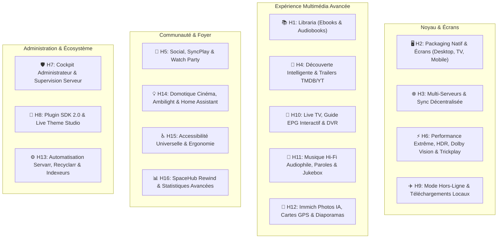

# 🚀 SpaceHub — Plan de Développement Exhaustif & Master Roadmap (v10)

> **Document de cadrage stratégique et technique ultime pour SpaceHub.**  
> **Dernière mise à jour :** 21/08/2026 — *Architecture complète : Performance, HDR, Live TV, Audiophile Hi-Fi, Immich AI, Domotique IoT, Admin Suite, Plugin SDK 2.0 & Accessibilité.*

---

## 🎯 Vision Globale & Positionnement
**SpaceHub** a pour ambition d'être l'expérience multimédia auto-hébergée absolue. Une application moderne, fluide et sans compromis qui fédère l'intégralité de l'écosystème multimédia personnel :
- **Vidéo & Cinéma** : Jellyfin, TMDB, Direct Play 4K HDR / Dolby Vision, Trickplay, Skip Intro, SyncPlay.
- **Musique & Audio** : Hi-Res Audiophile, Bit-Perfect, Paroles synchronisées, Jukebox collaboratif, WebGL Shaders.
- **TV & Direct** : IPTV M3U / HDHomeRun, Guide EPG 24h, Time-Shifting, DVR & Mosaïque Multiview.
- **Livres & Audiobooks** : Intégration Libraria, liseuse EPUB/PDF et lecteur audiobook à chapitrage.
- **Souvenirs & Photos** : Immich, recherche sémantique IA (CLIP), cartographie interactive de voyage.
- **Automatisation & Téléchargements** : Sonarr, Radarr, Prowlarr, Bazarr, Jellyseerr, qBittorrent, Recyclarr.
- **Domotique & Ambiance** : Home Assistant, Philips Hue Ambilight, automatisation des lumières de salon.

---

## 🗺️ Matrice Complète des 16 Horizons de Développement

---

## ⚡ Horizon 6 : Performance Vidéo Extrême, HDR, Codecs & Trickplay

### 1. Trickplay & Navigation Temporelle Fluide (Scrubbing)
- [ ] **Support Trickplay Jellyfin 10.9+** :
  - Détection automatique et chargement des vignettes Trickplay (`/Items/{id}/Trickplay/{width}/manifest.mpd` ou fichiers `.bif`).
  - Bulle de prévisualisation vidéo instantanée au survol de la timeline.
  - Défilement haute fluidité (thumbnails scrubbing) sur Desktop, Mobile et au D-Pad TV.
- [ ] **Saut Intelligent de Chapitres & Génériques** :
  - **Skip Intro / Skip Outro** : Intégration du plugin Jellyfin Intro Skipper avec bouton contextuel discret *"Passer l'intro"*.
  - **Passage Automatique à l'épisode suivant** : Compte à rebours en fin d'épisode avec lancement direct.
  - **Navigation par chapitres** : Menu des chapitres avec miniatures et titres dans le lecteur vidéo.

### 2. Formats Avancés, HDR & Rendu Visuel
- [ ] **Support Dolby Vision & HDR** :
  - Prise en charge du Dolby Vision (Profils 5, 7, 8 avec fallback HDR10 dynamique).
  - Rendu HDR10 / HDR10+ sur écrans et téléviseurs compatibles.
  - Tone-mapping côté client si l'écran ne supporte pas le HDR (évite les couleurs délavées sans forcer le transcodage serveur).
- [ ] **Codecs Haute Efficacité & Direct Play Maximal** :
  - Détection matérielle des capacités du client (AV1, HEVC/H.265, VP9, H.264).
  - Négociation de flux directe (**Direct Stream / Direct Play**) pour réduire à 0% la charge CPU/GPU du serveur.
  - Prise en charge des conteneurs MKV, MP4, WebM et TS sans ré-encapsulage inutile.

### 3. Audio Passthrough, Spatial & Sous-titres
- [ ] **Audio Haute Définition & Spatialisé** :
  - Passthrough audio (Bitstream) pour Dolby Atmos, TrueHD, DTS-HD Master Audio, DTS:X sur Desktop et Android TV.
  - FLAC multicanal 5.1 / 7.1 et stéréo Hi-Res 24-bit/192kHz pour l'écoute musicale audiophile.
  - **Normalisation Audio** : Égalisation automatique du volume (Night Mode / Dialogue Boost / ReplayGain).
- [ ] **Moteur de Sous-titres ASS/SSA Stylés sans Transcodage** :
  - Intégration d'un parseur/renderer WebAssembly (`libass` / `JavascriptSubtitlesOctopus`) pour afficher les sous-titres stylisés d'animes et films sans nécessiter de gravure vidéo serveur.

---

## 📡 Horizon 10 : Live TV, Guide EPG Interactif, Time-Shifting & DVR

- [ ] **Guide Électronique des Programmes (EPG) Interactif** :
  - Grille TV panoramique 24h avec défilement temporel horizontal ultra-fluide.
  - Fiche détaillée du programme en cours avec synopsis, acteurs, miniatures et barre d'avancement du direct.
  - Filtrage rapide par catégorie : Chaînes favorites, Généralistes, Sport, Cinéma, Infos, Jeunesse.
- [ ] **Time-Shifting & Contrôle du Direct** :
  - Mise en pause du direct, retour en arrière (rewind jusqu'à 2 heures) et reprise synchrone.
- [ ] **DVR & Enregistrements Programmés Intelligents** :
  - Enregistrement en 1 clic d'une émission en cours ou future.
  - **Enregistrement de Séries** : Règle automatique pour enregistrer tous les nouveaux épisodes d'une série sans doublon.
  - Gestion des conflits de tuners (HDHomeRun, Tuners USB, flux IPTV M3U / Xtream Codes).
- [ ] **Mosaïque Multiview (Picture-in-Picture & Multi-Écrans)** :
  - Visionnage simultané de 2 ou 4 chaînes en direct sur le même écran (idéal soirs de grands événements sportifs ou journées d'actualité).

---

## 🎵 Horizon 11 : Espace Musical Hi-Fi, Audiophile, Paroles & Jukebox

- [ ] **Moteur Audiophile Bit-Perfect** :
  - Mode sortie exclusive (WASAPI sous Windows, CoreAudio sous macOS, ALSA sous Linux) pour éviter tout rééchantillonnage de l'OS.
  - Prise en charge des formats DSD (Direct Stream Digital / DoP), FLAC Hi-Res 192kHz/24-bit, ALAC, WAV.
- [ ] **Paroles Synchronisées en Temps Réel** :
  - Intégration de l'API LRCLIB / Musixmatch / Genius.
  - Affichage karaoké avec défilement ligne par ligne fluide et mise en surbrillance rythmée.
- [ ] **Jukebox de Salon & File Collaborative** :
  - Génération d'un QR Code affiché sur l'écran : les invités peuvent scanner avec leur smartphone pour ajouter des morceaux à la file d'attente sans créer de compte ni installer d'application.
  - Système de vote (Upvote/Downvote) pour faire remonter les titres plébiscités dans la playlist de soirée.
- [ ] **Égaliseur Paramétrique & Effets DSP** :
  - Égaliseur 10 bandes intégré avec presets : *Basses amplifiées*, *Aigus précis*, *Voix acoustiques*, *Casque studio*.
  - Enchaînement fondu dynamique (Gapless playback + Smart Crossfade calculé sur les silences).
- [ ] **Visualiseur Audio WebGL 3D 60 FPS** :
  - Spectrogrammes, vagues sinusoïdales et shaders d'ambiance réactifs aux basses et transitoires.

---

## 📸 Horizon 12 : Immich & Gestion Photos/Vidéos Personnelles Avancée

- [ ] **Carte Interactive des Voyages (GPS Heatmap)** :
  - Vue cartographique mondiale interactive avec regroupement des photos et vidéos par localisation géographique.
  - Regroupement automatique en "Carnets de voyage" par date et destination.
- [ ] **Recherche Sémantique Visuelle par Intelligence Artificielle** :
  - Recherche en langage naturel dans les photos personnelles (ex: *"Coucher de soleil sur la plage"*, *"Chien qui court dans la neige"*, *"Soirée d'anniversaire"* via CLIP Embeddings).
- [ ] **Reconnaissance des Visages & Personnes** :
  - Navigation par personne avec chronologie des photos à travers les âges.
- [ ] **Diaporama Cinématique Intelligent (Ken Burns Effect)** :
  - Transitions douces, zooms progressifs et musique d'ambiance douce piochée dans la bibliothèque musicale Jellyfin.
- [ ] **Détecteur de Doublons & Optimisation Stockage** :
  - Analyse des photos similaires ou doublons pour aider l'utilisateur à trier ses souvenirs.

---

## ⚙️ Horizon 13 : Automatisation Servarr, Recyclarr & Surveillance

- [ ] **Gestionnaire de Requêtes Multimédia Intégré (Jellyseerr)** :
  - Demande de nouveaux films/séries en 1 clic directement depuis l'interface SpaceHub.
  - Suivi en temps réel de l'état de la demande (Demandé → Approuvé → En cours de téléchargement → Disponible).
  - Notifications Push de disponibilité (Discord, Telegram, Gotify, Webhook).
- [ ] **Optimisation de la Qualité Vidéo (Recyclarr & Trash Guides)** :
  - Application automatique des profils de qualité optimaux (Custom Formats Radarr/Sonarr : 4K Remux, 1080p Web-DL, HDR10/DV prioritaire).
- [ ] **Surveillance & Bascule Automatique des Indexeurs (Prowlarr)** :
  - Dashboard de santé des trackers torrent et newsgroups Usenet avec temps de réponse et taux de succès.
  - Bascule automatique si un indexeur tombe en panne.
- [ ] **Calendrier des Sorties Unifié & Export iCal** :
  - Calendrier interactif des futures sorties cinéma, séries et albums musicaux.
  - Lien d'abonnement de flux `.ics` pour intégration Google Calendar, Apple Calendar ou Outlook.

---

## 💡 Horizon 14 : Domotique Cinéma, Ambilight & Home Assistant

- [ ] **Ambiance Lumineuse Connectée (Home Assistant & Philips Hue)** :
  - Tamisage automatique des lumières de la pièce dès que la lecture commence.
  - Rallumage doux à 20% lors d'une mise en pause (pour aller chercher un verre sans être dans le noir).
  - Rallumage complet au générique de fin.
- [ ] **Ambilight Logiciel Temps Réel** :
  - Analyse des couleurs dominantes sur les bords de l'image vidéo et synchronisation en direct avec les bandes LED connectées (WLED, Philips Hue Sync, Govee).
- [ ] **Support Télécommandes Universelles & Matériel Dédié** :
  - Contrôle total via récepteurs IR/RF (FLIRC, Logitech Harmony).
  - Prise en charge HDMI-CEC pour allumer/éteindre la TV et l'amplificateur Home Cinema au lancement de SpaceHub.
- [ ] **Mode Kiosk & Écran Mural Dédié** :
  - Mode d'affichage permanent pour tablettes murales domotiques avec affichage du média en cours et commandes rapides.

---

## 🛡️ Horizon 7 : Administration Avancée & Cockpit Serveur (Admin Suite)

- [ ] **Moniteur d'Activité en Temps Réel** :
  - Liste de toutes les sessions actives : Utilisateur, appareil, adresse IP, débit binaire (Mbps), Direct Play vs Transcodage (codec vidéo/audio, raison du transcodage).
  - Charge matérielle : Accélération matérielle serveur (NVIDIA NVENC, Intel QSV, AMD AMF, VAAPI).
  - Contrôle direct : Interruption d'un flux ou envoi de message popup à un utilisateur.
- [ ] **Gestionnaire de Tâches & Maintenance** :
  - Lancement des scans de médiathèque, extraction Trickplay, actualisation des métadonnées, nettoyage du cache serveur.
  - Journal d'audit et logs Jellyfin filtrables en direct.
- [ ] **Gestion des Stockages & Alertes Disques** :
  - Jauges d'espace disque par médiathèque avec alertes de saturation (ex: > 90%).
- [ ] **Contrôle d'Accès, Quotas & Sécurité** :
  - Attribution de profils de restriction (bande passante max, résolution max 4K/1080p).
  - Plages horaires d'accès et contrôle parental renforcé par code PIN.

---

## 🧩 Horizon 8 : Écosystème Plugins & SDK 2.0 (Extensions Communautaires)

- [ ] **Points d'Injection UI Déclaratifs (UI Hooks)** :
  - Boutons personnalisés sur les fiches médias (liens IMDb, Trakt, Wikipedia, partage).
  - Nouveaux onglets dans la barre de navigation et widgets dynamiques sur le Dashboard.
  - Contrôles personnalisés dans la barre du lecteur vidéo.
- [ ] **Bac à Sable Sécurisé (Plugin Sandbox)** :
  - Système de permissions explicites (`network`, `player:control`, `storage:secure`, `admin`).
  - Isolation d'exécution pour garantir la stabilité de l'application.
- [ ] **Marketplace d'Extensions en Ligne** :
  - Prise en charge de dépôts de plugins tiers configurables (URL JSON).
  - Installation, mise à jour et désactivation en 1 clic.
- [ ] **Live Theme Studio** :
  - Éditeur de thèmes avec choix des palettes, flous glassmorphism et animations CSS.
  - Export/Import de fichiers de thème `.spacehub-theme.json`.

---

## ✈️ Horizon 9 : Mode Hors-Ligne & Téléchargements (Offline Sync)

- [ ] **Téléchargement Local Sécurisé** :
  - Téléchargement direct d'épisodes, saisons complètes ou films sur le stockage local (Desktop & Mobile).
  - Profils de transcodage préalable pour optimiser l'espace disque (ex: profil mobile 720p 2 Mbps).
- [ ] **Lecture Déconnectée Complète** :
  - Vue dédiée *"Mes Téléchargements"* opérationnelle sans aucune connexion Internet ni accès serveur.
- [ ] **Synchronisation Automatique de Retour en Ligne** :
  - Synchronisation instantanée de la position de lecture et du statut "Vu" sur Jellyfin dès la reconnexion au réseau.

---

## 🍿 Horizon 5 : Social, Foyer & SyncPlay

- [ ] **Jellyfin SyncPlay Natif** :
  - Création et adhésion à des salons de visionnage synchronisé à la seconde près.
  - Chat textuel superposé et réactions emojis en direct sur la vidéo.
- [ ] **Avis & Notes Locales du Foyer** :
  - Système d'étoiles et commentaires partagés entre membres du même serveur.
- [ ] **Collections & Playlists Collaboratives** :
  - Listes de lecture communes modifiables à plusieurs.

---

## ♿ Horizon 15 : Accessibilité Universelle & Ergonomie Sans Faille

- [ ] **Modes Daltonisme Intégrés** :
  - Filtres colorimétriques ajustés pour Protanopie, Deutéranopie et Tritanopie, et mode Contraste Élevé (Norme WCAG AAA).
- [ ] **Typographie Adaptée & Dyslexie** :
  - Option de police `OpenDyslexic` pour tous les textes, résumés et sous-titres de l'application.
- [ ] **Personnalisation Complète des Sous-titres** :
  - Réglage de la taille, couleur du texte, fond opaque/semi-transparent, position verticale et synchronisation temporelle manuelle au millième de seconde (Offset +/- 10s).
- [ ] **Support Lecteurs d'Écran & Synthèse Vocale** :
  - Balises ARIA complètes sur chaque bouton, carte et lecteur média.
  - Bascule automatique sur la piste d'Audio-Description si disponible.

---

## 📊 Horizon 16 : Statistiques Avancées & Rétrospective "SpaceHub Rewind"

- [ ] **Rétrospective Annuelle Interactive ("SpaceHub Rewind")** :
  - Infographie dynamique interactive de fin d'année (temps total de visionnage, acteurs favoris, réalisateurs préférés, genres les plus regardés, jour le plus actif).
  - Carte de partage téléchargeable pour les réseaux sociaux.
- [ ] **Cockpit de Statistiques Utilisateur & Foyer** :
  - Graphiques d'heures de visionnage par semaine/mois.
  - Badges et succès débloquables (ex: *"Marathonien de Séries"*, *"Cinéphile Nocturne"*, *"Explorateur de Classiques"*).

---

## 📚 Horizon 1 : Intégration Libraria (En attente backend)

- [ ] **Client API & Service Libraria** (`integrations/libraria/`)
- [ ] **Liseuse EPUB / PDF intégrée** avec marque-pages, surlignage et thèmes de lecture.
- [ ] **Lecteur de Livres Audio** avec chapitrage, vitesse variable (0.75x à 2.5x) et minuterie de mise en veille.

---

## 📋 Tableau Récapitulatif Exhaustif des 16 Horizons

| Horizon | Domaine | Cible Principale | Statut |
|---|---|---|:---:|
| **H1** | 📚 Livres & Audiobooks | Intégration Libraria | ⏳ En attente backend |
| **H2** | 🖥️ Packaging Natif | Desktop Electron, TV D-Pad, Mobile | ✅ Complété (v1.0) |
| **H3** | 🌐 Multi-Serveurs & Sync | Multi-Jellyfin, Sync décentralisée | ✅ Complété (v1.0) |
| **H4** | 🤖 Découverte & Trailers | Bandes-annonces TMDB/YT, Recherche IA | ✅ Complété (v1.0) |
| **H5** | 🍿 Social & SyncPlay | Visionnage synchrone, Chat, Salons | 🚀 Prêt à implémenter |
| **H6** | ⚡ Performance & HDR | Trickplay, Skip Intro, Dolby Vision, ASS | 🚀 Prêt à implémenter |
| **H7** | 🛡️ Cockpit Admin | Surveillance flux, GPU, Tâches serveur | 🚀 Prêt à implémenter |
| **H8** | 🧩 Plugin SDK 2.0 | UI Hooks, Sandbox, Theme Studio | 🚀 Prêt à implémenter |
| **H9** | ✈️ Mode Hors-Ligne | Téléchargement local, Sync retour réseau | 🚀 Prêt à implémenter |
| **H10** | 📡 Live TV & DVR | Guide EPG 24h, Time-Shift, Mosaïque | 🚀 Prêt à implémenter |
| **H11** | 🎵 Hi-Fi Audiophile | Bit-Perfect, Paroles temps réel, Jukebox | 🚀 Prêt à implémenter |
| **H12** | 📸 Immich Photos IA | Carte GPS mondiale, Diaporamas, CLIP | 🚀 Prêt à implémenter |
| **H13** | ⚙️ Servarr & Recyclarr | Jellyseerr, Prowlarr health, iCal | 🚀 Prêt à implémenter |
| **H14** | 💡 Domotique Cinéma | Home Assistant, Philips Hue Ambilight | 🚀 Prêt à implémenter |
| **H15** | ♿ Accessibilité | OpenDyslexic, Daltonisme, Sous-titres | 🚀 Prêt à implémenter |
| **H16** | 📊 Rewind & Statistiques | Rétrospective annuelle, Succès, Stats | 🚀 Prêt à implémenter |
