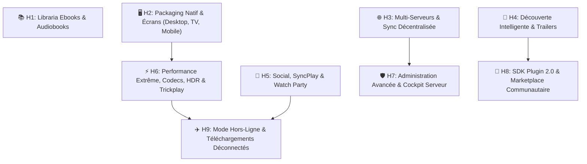

# 🚀 SpaceHub — Plan de Développement & Roadmap Étendue (v9)

> **Document de référence pour l'architecture, la performance et les fonctionnalités futures de SpaceHub.**  
> **Dernière mise à jour :** 21/08/2026 — *Intégration Performance, HDR/Dolby Vision, Trickplay, Admin Suite & Plugin SDK 2.0*

---

## 🎯 Vision Stratégique
Faire de **SpaceHub** le client Jellyfin et Media Center unifié le plus performant, fluide et personnalisable du marché :
- **Pour les Utilisateurs** : Une expérience de lecture instantanée (0 transcodage inutile), une qualité audiovisuelle maximale (HDR, Dolby Vision, Dolby Atmos, Trickplay scrubbing) et une interface élégante et immersive sur tous les écrans.
- **Pour les Administrateurs** : Un cockpit complet de supervision serveur, contrôle des flux et transcodages en direct, gestion fine des utilisateurs et automatisations Servarr.
- **Pour les Développeurs** : Un écosystème d'extensions modulaire avec un SDK riche, des points d'injection UI et un bac à sable sécurisé.

---

## 🗺️ Vue d'Ensemble des Horizons

---

## ⚡ Horizon 6 : Performance Vidéo Extrême, HDR, Codecs & Trickplay

### 1. Trickplay & Navigation Temporelle Fluide (Scrubbing)
- [ ] **Support Trickplay Jellyfin 10.9+** :
  - Détection automatique et chargement des vignettes Trickplay (`/Items/{id}/Trickplay/{width}/manifest.mpd` ou fichiers `.bif`).
  - Bulle de prévisualisation vidéo instantanée au survol de la barre de progression (timeline).
  - Défilement haute fluidité (thumbnails scrubbing) sur Desktop, Mobile et au D-Pad TV.
- [ ] **Saut Intelligent de Chapitres & Génériques** :
  - **Skip Intro / Skip Outro** : Détection des marqueurs d'introduction Jellyfin (Plugin Intro Skipper) avec bouton contextuel discret *"Passer l'intro"*.
  - **Passage Automatique à l'épisode suivant** : Compte à rebours en fin d'épisode avec lancement direct.
  - **Navigation par chapitres** : Menu des chapitres avec miniatures et titres dans le lecteur vidéo.

### 2. Formats Avancés, HDR & Rendu Visuel
- [ ] **Support Dolby Vision & HDR** :
  - Prise en charge du Dolby Vision (Profils 5, 7, 8 avec fallback HDR10 dynamique).
  - Rendu HDR10 / HDR10+ sur écrans et téléviseurs compatibles.
  - Tone-mapping côté client si l'écran ne supporte pas le HDR (évite les couleurs délavées sans forcer le transcodage serveur).
- [ ] **Codecs Haute Efficacité & Direct Play Maximal** :
  - Détection matérielle des capacités du client (AV1, HEVC/H.265, VP9, H.264).
  - Négociation de flux directe (**Direct Stream / Direct Play**) pour réduire à 0% la charge CPU/GPU du serveur Jellyfin.
  - Prise en charge des conteneurs MKV, MP4, WebM et TS sans ré-encapsulage inutile.

### 3. Audio Passthrough, Spatial & Sous-titres
- [ ] **Audio Haute Définition & Spatialisé** :
  - Passthrough audio (Bitstream) pour Dolby Atmos, TrueHD, DTS-HD Master Audio, DTS:X sur Desktop et Android TV.
  - FLAC multicanal 5.1 / 7.1 et stéréo Hi-Res 24-bit/192kHz pour l'écoute musicale audiophile.
  - **Normalisation Audio** : Égalisation automatique du volume (Night Mode / Dialogue Boost / ReplayGain) pour les films aux écarts sonores violents.
- [ ] **Moteur de Sous-titres ASS/SSA Stylés sans Transcodage** :
  - Intégration d'un parseur/renderer WebAssembly (`libass` / `JavascriptSubtitlesOctopus`) pour afficher les sous-titres stylisés d'animes et films sans nécessiter de gravure vidéo serveur.

---

## 🛡️ Horizon 7 : Administration Avancée & Cockpit Serveur (Admin Suite)

### 1. Supervision des Flux & Transcodages en Temps Réel
- [ ] **Moniteur d'Activité en Direct** :
  - Liste de tous les utilisateurs connectés et des sessions en cours de lecture.
  - Affichage détaillé par flux : Débit binaire (Mbps), méthode de lecture (Direct Play vs Transcodage), codecs source et cible, raison du transcodage (ex: *sous-titre non supporté, débit trop élevé*).
  - Charge matérielle : Suivi de l'accélération matérielle serveur (NVIDIA NVENC, Intel QSV, AMD AMF, VAAPI).
  - Actions immédiates : Possibilité pour l'administrateur d'envoyer un message popup à un utilisateur ou d'interrompre une session.

### 2. Gestionnaire de Tâches & Maintenance
- [ ] **Contrôle des Tâches Jellyfin depuis SpaceHub** :
  - Lancement et annulation des scans de médiathèque, extraction Trickplay, actualisation des métadonnées, nettoyage des fichiers temporaires.
  - Journal d'audit et historique des erreurs serveur (logs Jellyfin filtrables en direct).
- [ ] **Gestion des Stockages & Alertes Disques** :
  - Visualisation de l'espace disque restant par point de montage / médiathèque.
  - Alertes visuelles configurables (ex: seuil critique à 90% d'occupation).

### 3. Utilisateurs, Quotas & Sécurité
- [ ] **Contrôle d'Accès Fin** :
  - Attribution de profils de restriction (bande passante max par utilisateur, résolution maximale autorisée 4K/1080p).
  - Plages horaires d'accès et contrôle parental renforcé par code PIN.
  - Journal des connexions suspectes ou échecs d'authentification.

---

## 🧩 Horizon 8 : Écosystème Plugins & SDK 2.0 (Extensions Communautaires)

### 1. Architecture SDK Étendue (`core/extensions/`)
- [ ] **Points d'Injection UI Déclaratifs (UI Hooks)** :
  - Injection de boutons personnalisés sur les fiches médias (ex: *Lien IMDB, bouton de partage, lien vers fiche Wiki*).
  - Injection d'onglets personnalisés dans la barre de navigation.
  - Injection de widgets dynamiques dans le Dashboard d'accueil.
  - Injection de contrôles personnalisés dans la barre du lecteur vidéo.
- [ ] **Bac à Sable Sécurisé (Plugin Sandbox)** :
  - Système de permissions explicites (`permissions: ["network:tmdb.org", "player:control", "storage:secure"]`).
  - Isolation de l'exécution pour protéger l'application contre les crashs d'extensions tierces.

### 2. Marketplace & Personnalisation Visuelle
- [ ] **Magasin d'Extensions en Ligne (Marketplace)** :
  - Prise en charge de dépôts de plugins distants configurables (URL JSON).
  - Installation, activation/désactivation et mise à jour en 1 clic.
- [ ] **Éditeur de Thèmes en Direct (Live Theme Studio)** :
  - Création de thèmes personnalisés avec choix des couleurs, polices, flous glassmorphism et fonds animés.
  - Import/Export de thèmes sous format de fichiers légers `.spacehub-theme.json`.

---

## ✈️ Horizon 9 : Mode Hors-Ligne & Téléchargements (Offline Sync)

### 1. Téléchargement pour Voyage & Mobilité
- [ ] **Téléchargement Local Sécurisé** :
  - Téléchargement direct d'épisodes, saisons complètes ou films sur le stockage local (Desktop & Mobile).
  - Option de transcodage préalable pour réduire la taille du fichier avant téléchargement (ex: profil mobile 720p 2 Mbps).
- [ ] **Lecture 100% Déconnectée** :
  - Vue dédiée *"Mes Téléchargements"* accessible même sans connexion Internet ni accès au serveur Jellyfin.
  - Chiffrement des fichiers locaux pour préserver la confidentialité sur appareils nomades.
- [ ] **Synchronisation de Retour en Ligne** :
  - Enregistrement de la progression de lecture en local.
  - Mise à jour automatique de l'état "Vu" et de la position de reprise sur le serveur Jellyfin dès la reconnexion au réseau.

---

## 🍿 Horizon 5 : Social, Foyer & SyncPlay (Rappel & Compléments)

- [ ] **Jellyfin SyncPlay Natif** :
  - Création et adhésion à des salons de visionnage synchrone multi-utilisateurs.
  - Synchronisation temporelle à la seconde près (Play, Pause, Avance/Retour synchrone).
  - Mini-chat textuel superposé et réactions emoji en direct sur la vidéo.
- [ ] **Avis & Notes Locales du Foyer** :
  - Système de notation par étoiles et commentaires internes partagés entre utilisateurs du même serveur.
- [ ] **Listes de Lecture & Collections Collaboratives** :
  - Playlists vidéo et musicales créées et modifiables à plusieurs.

---

## 📚 Horizon 1 : Intégration Libraria (En attente de finalisation du backend)

- [ ] **Client API & Service Libraria** (`integrations/libraria/`)
- [ ] **Liseuse EPUB / PDF intégrée** (`jellyfin/player/book/BookReader.js`) avec marque-pages, recherche textuelle et thèmes sépia/nuit.
- [ ] **Lecteur de Livres Audio** (`jellyfin/player/audiobook/AudiobookPlayer.js`) avec gestion des chapitres, reprise automatique et vitesse variable (0.75x à 2.5x).

---

## 📊 Tableau Récapitulatif des Horizons

| Horizon | Statut | Cible Prioritaire |
|---|:---:|---|
| **H1 : Libraria (Livres & Audiobooks)** | ⏳ En attente backend | Ebooks / Audiobooks |
| **H2 : Packaging Natif (Desktop, TV, Mobile)** | ✅ Complété (v1.0) | Desktop / TV D-Pad |
| **H3 : Multi-Serveurs & Sync Décentralisée** | ✅ Complété (v1.0) | Multi-Jellyfin / Sync |
| **H4 : Découverte Intelligente & Trailers** | ✅ Complété (v1.0) | Trailers / Recherche Naturelle |
| **H5 : Social, SyncPlay & Watch Party** | 📋 Planifié | Communauté / Salons |
| **H6 : Performance, HDR/Dolby Vision & Trickplay** | 🚀 Prêt à implémenter | Vidéo HD / Scrubbing |
| **H7 : Cockpit Admin & Supervision** | 🚀 Prêt à implémenter | Supervision / Transcodage |
| **H8 : Plugin SDK 2.0 & Marketplace** | 🚀 Prêt à implémenter | Écosystème Développeurs |
| **H9 : Mode Hors-Ligne & Téléchargements** | 🚀 Prêt à implémenter | Mobilité / Offline |
