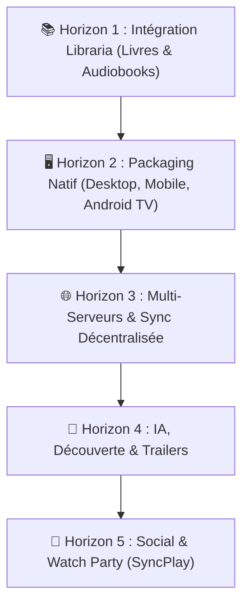

# SpaceHub — Plan de Développement Futur (Roadmap v8)

> Document de cadrage stratégique pour l'évolution de SpaceHub au-delà de la v1.0.
> Date : 21/08/2026

---

## 🎯 Vision Globale
Faire de **SpaceHub** la plateforme multimédia auto-hébergée ultime : **une seule application pour la vidéo, la musique, les photos, les livres, les audiobooks, la TV en direct et la suite Servarr**, utilisable avec une fluidité native sur Ordinateur, Téléphone et Téléviseur.

---

## 🗺️ Les 5 Horizons de Développement

---

## 📚 Horizon 1 : Intégration Libraria (Ebooks & Audiobooks)
- [ ] **Client API Libraria** (`integrations/libraria/LibrariaApi.js`)
- [ ] **Service métier Libraria** (`integrations/libraria/LibrariaService.js`)
- [ ] **Widgets Dashboard** : "Lecture en cours", "Derniers livres audio"
- [ ] **Liseuse EPUB / PDF intégrée** (`jellyfin/player/book/BookReader.js`)
- [ ] **Lecteur de Livres Audio** (`jellyfin/player/audiobook/AudiobookPlayer.js`) avec vitesse variable et chapitrage

---

## 🖥️ Horizon 2 : Packaging Natif (Desktop, Mobile, TV)
- [ ] **Desktop Electron / Tauri** :
  - [ ] Génération des exécutables Windows (.exe), Mac (.dmg), Linux (.AppImage)
  - [ ] Discord Rich Presence (RPC)
  - [ ] Touches multimédias clavier globales et réduction System Tray
- [ ] **Android TV / Mode 10-foot** :
  - [ ] Navigation D-Pad télécommande optimisée
  - [ ] Focus visuel renforcé pour grand écran
- [ ] **Mobile Capacitor (Android & iOS)** :
  - [ ] Gestes tactiles (volume/luminosité par glissement)
  - [ ] Lecture audio en arrière-plan et notifications écran de verrouillage

---

## 🌐 Horizon 3 : Multi-Serveurs & Synchronisation
- [ ] **Gestionnaire Multi-Serveurs** : Bascule en 1 clic entre plusieurs instances Jellyfin
- [ ] **Recherche Fédérée** : Interrogation simultanée de plusieurs serveurs
- [ ] **Sync Décentralisée** : Export et réplication des favoris/watchlist entre appareils

---

## 🤖 Horizon 4 : Découverte Intelligente & Immersion
- [ ] **Bandes-annonces Intégrées** : Lecture des trailers TMDB / YouTube directement sur les fiches
- [ ] **Moteur de Recommandation Local** : Suggestions personnalisées basées sur l'historique
- [ ] **Recherche en Langage Naturel** : Requêtes avancées par critères combinés

---

## 🍿 Horizon 5 : Social & Foyer
- [ ] **SyncPlay / Watch Party** : Visionnage synchronisé multi-utilisateurs à distance
- [ ] **Avis & Notes Locales** : Système d'évaluation partagé entre membres du foyer
- [ ] **Collections & Playlists Partagées** : Partage de sélections personnalisées
